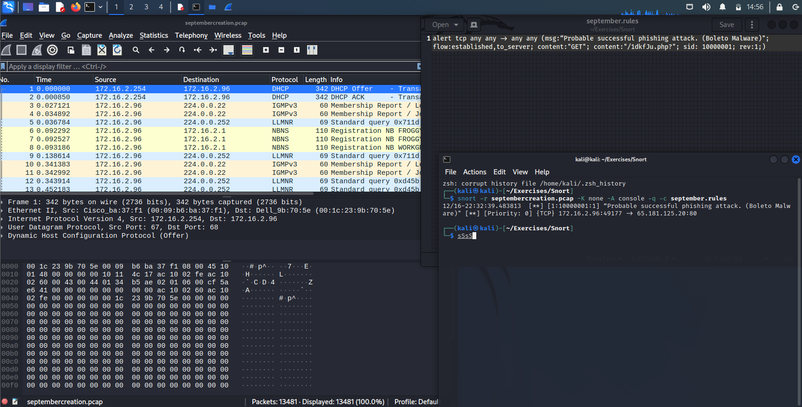
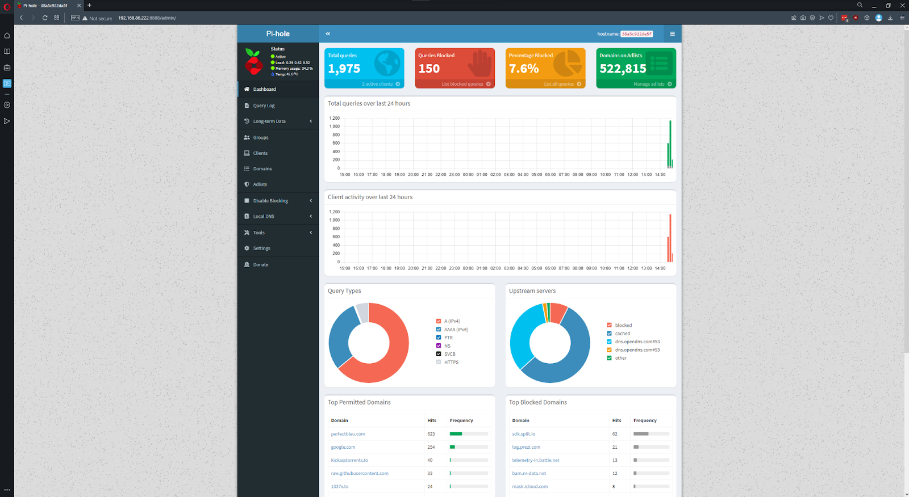
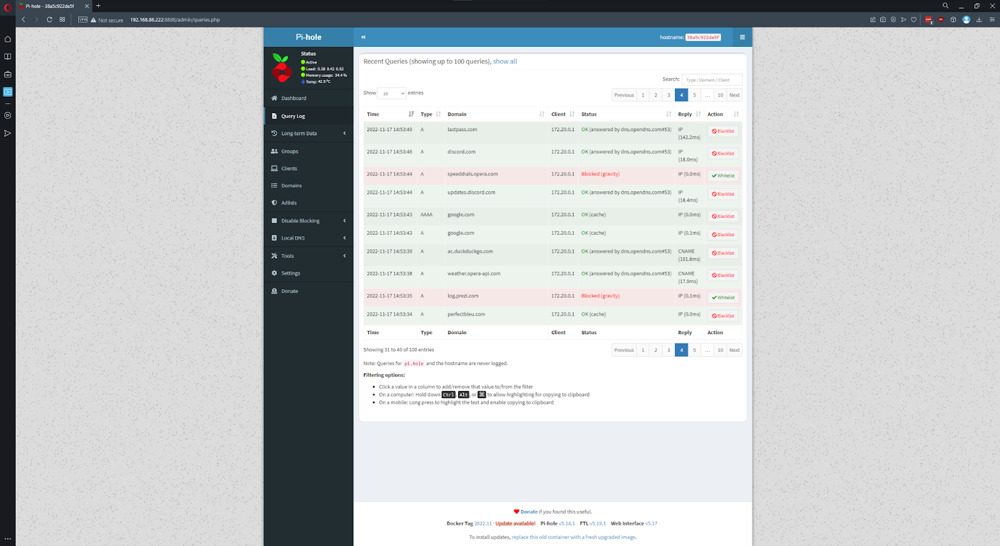
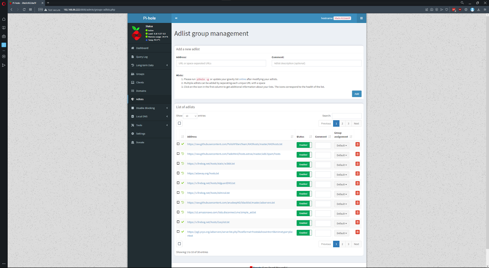
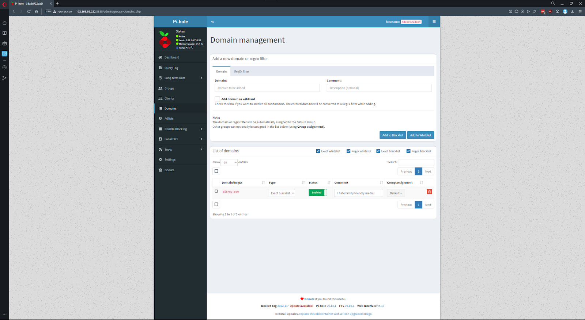
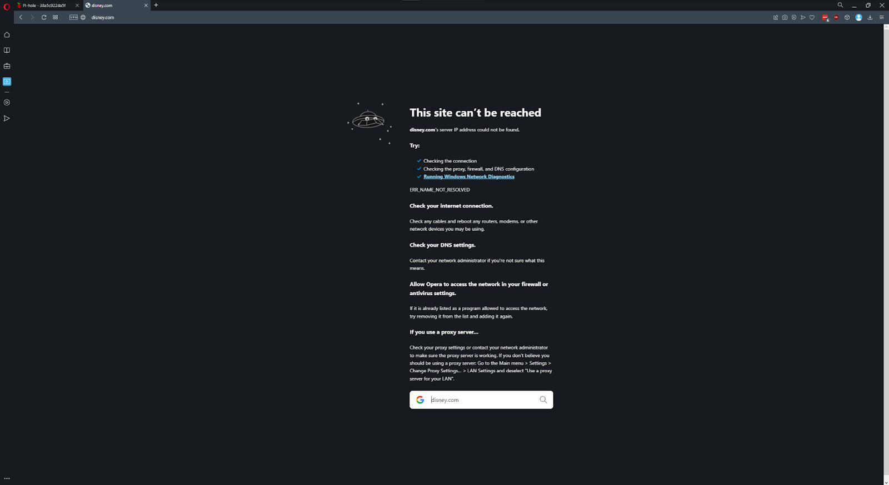

# forensics_creations
This is a repository for tracking our creations for our Digital Forensics class.
## September Creation: Boleto Malware Snort Rule

We created a Snort Rule that alerts when evidence of the Boleto malware is detected. The rule looks for the traffic to a specifically-named PHP file (“/1dkfJu.php?”). This URL is used in a phishing attack sent to the user. When the user clicks on the link, it downloads malware to their computer. The snort rule sends an alert when the user clicks on the malicious link by looking for a GET request connected to that specific PHP file name.

### Background on Boleto Malware

In Brazil, payments are made online using forms called “Boletos.” These forms are used nationally and contain payment information similar to bank account details used in America. A relatively new attack on these forms is when a threat actor uses malicious payloads (or malware) in order to steal or change the payment credentials on forms as the user submits them. Normally these attacks go unnoticed until long after the user has submitted payment, and they can be difficult to track and reverse. As of today, Boleto malware has caused millions of dollars of monetary loss. 


### Breaking Down the Snort Rule

#### Full Snort Rule: 

```
alert tcp any any -> any any (msg:“Probable successful phishing attack. (Boleto Malware)"; flow:established,to_server; content:"GET"; content:"/1dkfJu.php?"; sid: 10000001; rev:1;) 
```

#### Breakdown

- alert - this tells Snort that we want to be alerted
- tcp - we are looking for tcp/HTTP traffic
- any any (first) - analyzing traffic from any source (in this case the user)
- any any (second) - analyzing traffic to any destination (the malicious web server)
- msg: - a description of the issue, the message we want to receive with the alert
- flow: - defines the traffic flow - in this case it is established and to_server
- content: - defining the specific content we are looking for - in this case “GET” and the PHP file name
- sid: - the Snort ID number

### Test Case Evidence



Applications Used:
Kali Linux VM
Wireshark
SNORT

To begin the test case we analyzed Wireshark traffic. The source and destination found on Wireshark matched the content we were searching for with our SNORT rule. Since the content matched what we were searching for SNORT was able to notify us of the potential phishing attack. 

## November Creation: 

We created a local instance of Pi-Hole running in Docker. 

### Background on Pi-Hole


Pi-Hole is a tool developed by Jacob Samela. The purpose of Pi-Hole is to block domains at a network level. It works as a DNS sinkhole, primarily to block ads network-wide. This protects your network from ads and ad trackers without requiring any setup on individual devices. These blocks can be applied to any network device using the Pi-Hole as its DNS server.

Using Pi-Hole allows users to escape the hassle and tediousness of having to block ads and trackers manually on each individual device, including web browsers, phones, tablets, and IoT devices. Pi-Hole requires the following:

- At least 512mb of RAM,
- 2GB of free storage space,
- Access to your router’s administration panel, and
- Internet connection from the server you’re installing Pi-Hole on to the router, either via Wi-Fi or via Ethernet cable.


### The Docker-Compose file


#### Docker-Compose Breakdown

How to Start the Container and Add Adlists:

1. Open the command line and navigate to the folder with your docker-compose.yaml file
2. Type in “docker-compose up -d”
- This will run through your docker-compose file and spin up a container for every entry it finds. In this case we only have Pihole in there so that is the only container it will create.
- The “-d” creates it in detached mode so you won’t see all of the output from the process of creating it.
3. Watch the console and if all goes well you should see that Pihole was created successfully.
4. Navigate to the IP address of the machine it is on followed by “:8888/admin/login.php”
5. Sign in with the credentials you set in the docker-compose file
6. Select “Adlists” from the side navigation bar. 
7. Place in the adlists you would like to use in the “Address” field and hit “Add”
8. Click on the link that says “online” in the Hints section to update the adlists in Pihole’s settings

General Tips:

- Start with one or two adlists and then build from there. The more you add, the longer it will take to process each request. 
- If you use Pihole as a network wide DNS then make sure to have a backup DNS provider just in case the Pihole goes down. If you don’t specify a backup then you will be unable to access the internet via DNS. 
- If you like a list but it blocks a certain domain that you like, don’t edit the list–just add the domain you want to access to your whitelist!
- Remember that Pihole doesn’t just block computer ads. It can block telemetry, Smart TV ads, phone game ads, fake news websites, gambling sites, and inappropriate content.


### Test Case Evidence



<figcaption>The Pihole interface</figcaption>



<figcaption>Queries being allowed and blocked</figcaption>



<figcaption>Where to add adlists/blocklists</figcaption>



<figcaption>Blocking Disney.com for testing purposes</figcaption>



<figcaption>Disney.com is blocked</figcaption>
